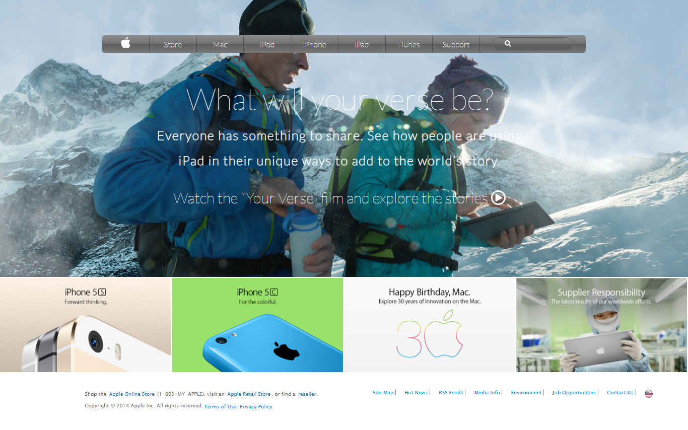

# AppleClone_project

The goal of the project was to make a clone of an old version of the Apple website webpage (2014).

> This project helped me master the concepts of using images as a background and adding gradients to elements.
> I learned to size and position the page using correct semantic HTML elements appropriately.
> Correctly setting up the navigation bar.

## Built With
- HTML
- CSS
- Google fonts
- Font Awesome

  

## Live Demo

[Live Demo Link](https://naqhid.github.io/AppleClone_project/)

## Getting Started

To get local copy up and running just clone the Repository.

## Authors

:bust_in_silhouette: **Author1**

- GitHub: [@Naqhid](https://github.com/Naqhid)s
- Twitter: [Naqhid](https://twitter.com/naqhid)
- LinkedIn: [Naqhid](https://www.linkedin.com/in/mohammed-naqhid-ab3080189/)

:bust_in_silhouette: **Author2**

- GitHub: [@davidosky007](https://github.com/davidosky007)
- Twitter: [@davidosky2](https://twitter.com/Davidosky2)
- LinkedIn: [David Bassey](https://www.linkedin.com/in/david-bassey-2b9671199/)

## :handshake: Contributing

Contributions, issues, and feature requests are welcome!

Feel free to check the [issues page](https://github.com/Naqhid/AppleClone_project/issues).

## Show your support

Give a :star: if you like this project

## Acknowledgments

- Project originally taken from The Odin Project
- Project inspired by Microverse Program

## License

